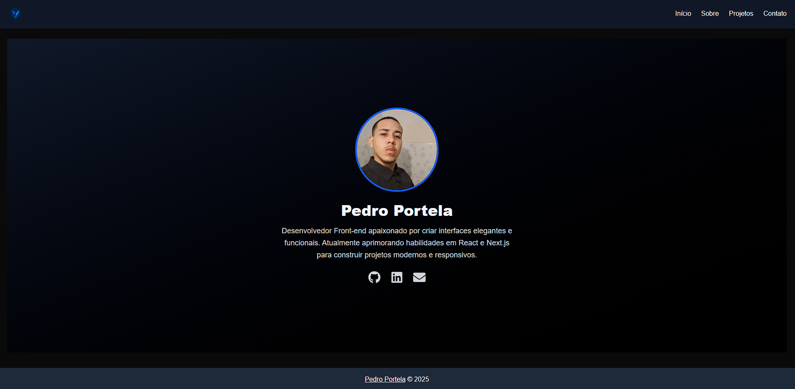

# 💼 Meu Portfólio Pessoal — [Pedro Henrique Alves Portela]

Bem-vindo(a) ao meu portfólio de desenvolvedor! Este projeto foi criado com **Next.js 13+**, **Tailwind CSS** e **Framer Motion**, com o objetivo de apresentar meus projetos, habilidades e um pouco da minha personalidade como profissional.

---

## 🚀 Tecnologias Utilizadas

- [Next.js](https://nextjs.org/) — App Router + SSR + Metadata
- [Tailwind CSS](https://tailwindcss.com/) — Estilização rápida e responsiva
- [Framer Motion](https://www.framer.com/motion/) — Animações suaves
- [Lucide Icons](https://lucide.dev/) — Ícones modernos
- [TypeScript](https://www.typescriptlang.org/) — Código mais seguro e escalável

---

## ✨ Funcionalidades

- 🔥 Design moderno e responsivo
- 🌗 Tema escuro (Dark Mode) [*se aplicável*]
- 📱 Totalmente adaptado para mobile
- 🎯 Transições animadas entre páginas
- 📂 Organização por seções: Início, Sobre, Projetos, Contato
- 📷 Logo personalizada com imagem

---

## 📷 Preview

> *(Adicione aqui uma imagem ou gif mostrando o site)*



---

## 🌐 Acesse Online

[➡️ Clique aqui para visitar o portfólio](https://seu-dominio.vercel.app)

---

## 🛠️ Como Rodar Localmente

```bash
# Clone o repositório
git clone https://github.com/phaportela/meu-portfolio.git
cd seu-repo

# Instale as dependências
npm install

# Rode em ambiente de desenvolvimento
npm run dev
